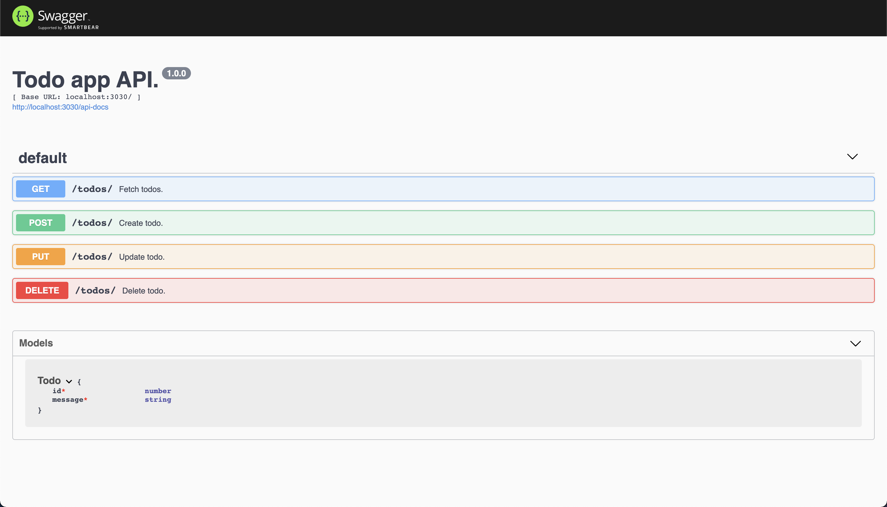

# Express OpenAPI

Code for the article: <https://www.freecodecamp.org/news/how-to-build-explicit-apis-with-openapi/>

This codebase shows how to build an [OpenAPI](https://www.openapis.org/)-backed [express](https://expressjs.com/) application.

## How to run

```bash
# Install dependencies
npm i

# Run app
npm run start
```

## Dynamic API documentation

Thanks to its OpenAPI compliance, the app auto-generates the documenation of the API on the fly.

Available in <http://localhost:3030/api-documentation>, while the app is running.



## License

MIT © [Alain Perkaz](https://aperkaz.github.io)
